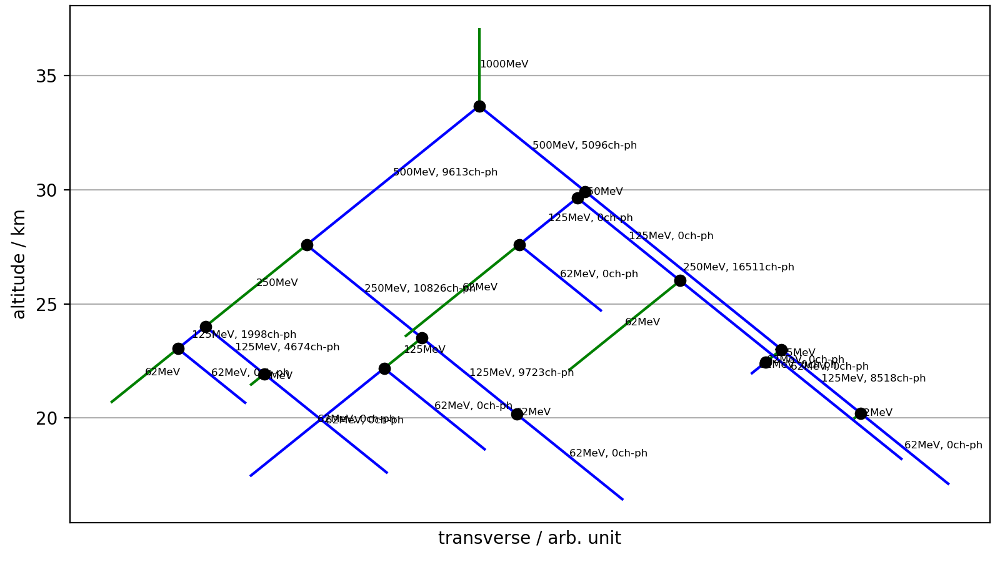

# A toy simulation for air-showers induced by gamma-rays

Simulate the electro-magnetic particle-cascade and the Cherenkov-emission of an air-shower.
Based on the Heitler-modell and the Frank-Tamm-formula.
The simulation is one-dimensional, i.e. there is no transversal component yet.

## install

download from github and:
```
pip install -e ./toy_air_shower
```
Use ```-e``` for editable in order to modify the simulation without reinstalling.

## run:

```python
import toy_air_shower as tas

particles, cherenkov_photons = tas.simulate_gamma_ray_air_shower(
    random_seed=0,
    primary_energy=1e9*tas.UNIT_CHARGE,
    wavelength_start=250e-9,
    wavelength_end=700e-9)

save_shower_figure(
    particles,
    cherenkov_photons,
    "readme/example_air_shower.png")
```


